# Web Development Specification: Personal Portfolio Website

## Project Overview
- **Project Name**: WebDev Portfolio - Nghia
- **Version**: 1.0.0
- **Date**: March 22, 2026
- **Author**: GitHub Copilot

## 1. Executive Summary
This project is a modern, responsive personal portfolio website for Nguyen Tuan Nghia, a web developer. The website showcases his skills, projects, and provides contact information. Built with React, TypeScript, and Tailwind CSS for optimal performance and user experience.

## 2. Requirements

### Functional Requirements
- Display hero section with introduction and avatar
- Showcase personal information in About section
- List technical skills with visual representation
- Display portfolio projects with images, descriptions, and tech stacks
- Provide contact form and information
- Include footer with additional links
- Responsive design for mobile, tablet, and desktop
- Smooth scrolling navigation
- Dark/light theme support

### Non-Functional Requirements
- **Performance**: Fast loading (<3s), optimized images
- **Security**: Secure contact form, no data breaches
- **Usability**: Intuitive navigation, accessible design
- **Compatibility**: Modern browsers, mobile devices

## 3. Architecture

### System Architecture
Single-page application (SPA) with React Router for navigation. Component-based architecture using reusable UI components from Shadcn/ui.

### Technology Stack
- **Frontend**: React 18, TypeScript, Vite
- **Styling**: Tailwind CSS, Shadcn/ui components
- **Routing**: React Router DOM
- **State Management**: React Query for API calls
- **Forms**: React Hook Form with Zod validation
- **Icons**: Lucide React
- **Build Tool**: Vite
- **Testing**: Vitest, Testing Library

### Data Models
- Projects: Array of objects with title, description, tech stack, images, links
- Skills: Array of skill categories with proficiency levels
- Contact: Form data with validation

### Component Architecture

```mermaid
graph TD
    A[App.tsx] --> B[BrowserRouter]
    B --> C[Routes]
    C --> D[Index Page]
    C --> E[NotFound Page]
    D --> F[Navbar]
    D --> G[Hero]
    D --> H[About]
    D --> I[Skills]
    D --> J[Projects]
    D --> K[Contact]
    D --> L[Footer]
    
    G --> M[Avatar Image]
    J --> N[Project Cards]
    N --> O[Tech Tags]
    
    style A fill:#e1f5fe
    style D fill:#f3e5f5
```

## 4. User Stories
- As a visitor, I want to see an attractive hero section so that I get a good first impression
- As a potential employer, I want to view projects with details so that I can assess the developer's capabilities
- As a visitor, I want to contact the developer easily so that I can reach out for opportunities
- As a user, I want the site to work on my mobile device so that I can view it anywhere

## 5. Implementation Plan

### Phases
1. **Setup**: Project initialization with Vite, TypeScript, Tailwind
2. **Components**: Build reusable UI components
3. **Pages**: Create main page with sections
4. **Styling**: Implement responsive design and animations
5. **Testing**: Add unit and integration tests
6. **Deployment**: Configure build and deployment

### Tasks
- Set up project structure and dependencies
- Create Navbar component with smooth scrolling
- Implement Hero section with avatar and intro
- Build About section
- Develop Skills section with progress indicators
- Create Projects grid with hover effects
- Add Contact form with validation
- Implement Footer
- Add responsive breakpoints
- Configure theme switching
- Write tests for components
- Optimize performance and accessibility

## 6. Testing Strategy
- Unit tests for individual components
- Integration tests for page functionality
- E2E tests for user flows (future)
- Accessibility testing with axe-core
- Performance testing with Lighthouse

## 7. Deployment and Maintenance
- **Deployment**: Build with Vite, deploy to static hosting (Vercel/Netlify)
- **Monitoring**: Google Analytics for traffic
- **Maintenance**: Regular dependency updates, content updates

## 8. Risks and Mitigation
- Browser compatibility: Test on multiple browsers
- Performance issues: Optimize images and code splitting
- Content updates: Make content easily editable

## 9. Success Criteria
- Lighthouse score >90 for performance, accessibility, best practices
- Mobile-friendly design
- Fast loading times
- Positive user feedback
- Successful contact form submissions